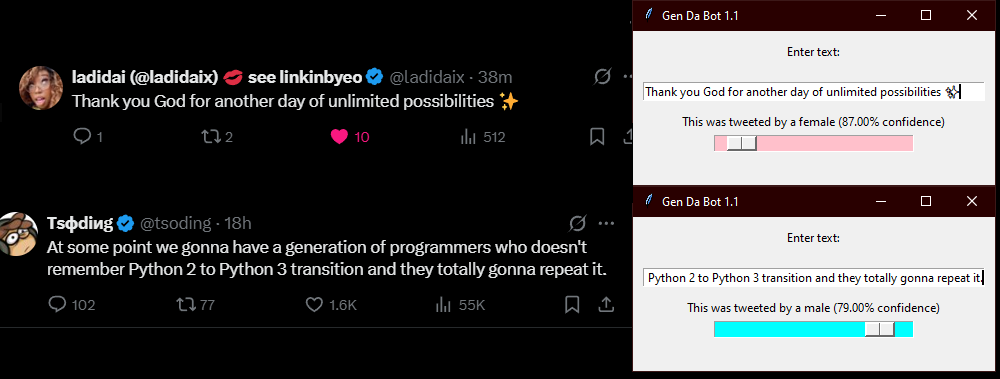
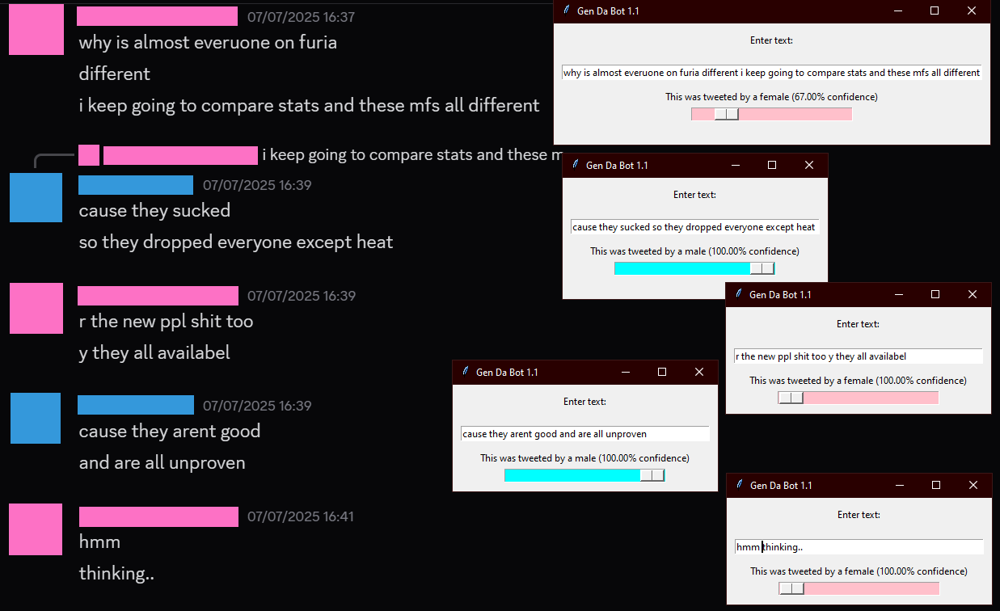

## GenDaBot

Machine Learning Project made with PyTorch that classifies the sex of tweet authors. Trained on >100,000 tweets and peaked at 85% test accuracy. Made an accompanying user-friendly GUI.

## Quickstart
To run this yourself, you'll need a cohere API key and a modern python installation

# In .env
COHERE_KEY_1=<your_key>

Clone the repo
`git clone https://github.com/BeanyZoldyck/GenDaBot.git`
`cd GenDaBot`

Install dependencies
`pip install -r requirements.txt`

run the GUI
`python3 GUI.pyw`
